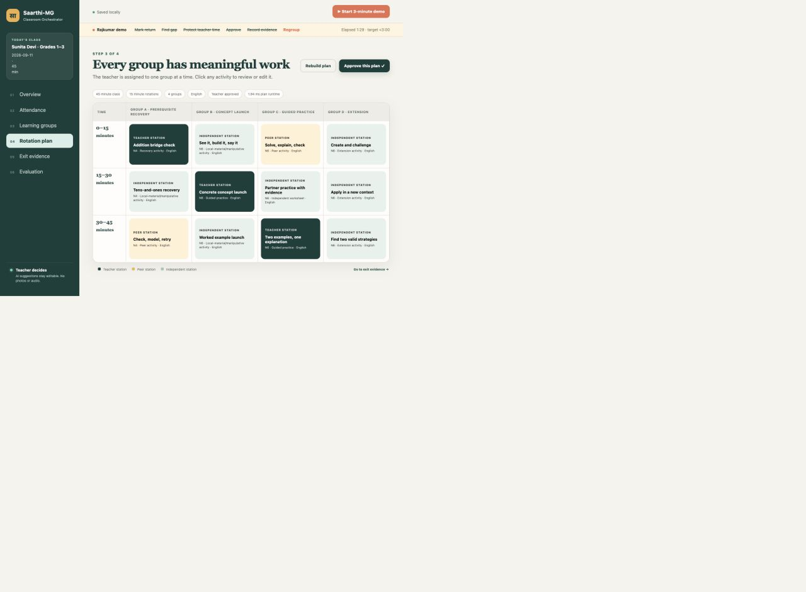

# Saarthi-MG

Saarthi-MG is a teacher-first classroom orchestrator for Grades 1–3 multigrade classrooms. It converts attendance and current learning evidence into explainable groups, protects scarce teacher time with a conflict-free rotation, gives every other group meaningful low-resource work, and uses quick checks to update the next plan.



## The problem

One teacher may need to teach several grades and learning levels at once. A conventional lesson plan describes content, but it does not answer the operational questions that matter during class: who needs the teacher first, what everyone else should do, which prerequisite an absent learner missed, and what should change tomorrow. Generic chat prompts also lack persistent learner state, hard scheduling constraints, approved sources, and an evidence loop.

## What the prototype does

- Loads a fixed, synthetic 35-learner Grade 1–3 classroom on one teacher device.
- Records attendance without treating absence as failure.
- Detects prerequisite gaps from mastery, recency, and missed lessons.
- Creates at most four flexible groups by learning need; language selects a scaffold instead of segregating learners.
- Ranks teacher attention with visible factors and supports teacher overrides.
- Generates a rotation in which exactly one group receives the teacher and every group has work in every time slot.
- Generates editable English or Hindi activities from an approved local curriculum corpus, with offline templates and strict validation.
- Records observations and exit-check evidence, updates mastery deterministically, and regenerates tomorrow’s groups.
- Prints station cards and exit tickets and caches the app shell for low-connectivity use.

The teacher must approve the plan. Rejected activities block approval until they are edited or regenerated.

## Run locally

Requirements: Python 3.9 or newer. There are no third-party runtime dependencies.

```bash
cd /path/to/saarthi_mg
python3 backend/server.py --port 8000
```

Open [http://127.0.0.1:8000](http://127.0.0.1:8000), then choose **Start 3-minute demo**. Persistent state is stored atomically in `data/database.json`; the demo button restores the fixed starting state.

Optional model generation is enabled only when both variables are present:

```bash
export ANTHROPIC_API_KEY="..."
export SAARTHI_LLM_MODEL="..."
```

If the model or network is unavailable, validated curriculum-grounded templates keep the workflow usable.

## Two-minute demo journey

1. Start the demo and open attendance. Rajkumar is visibly returning after a missed class.
2. Save attendance. The system finds his incomplete N4 addition prerequisite for today’s N6 subtraction target.
3. Review the four learning groups. Rajkumar’s recovery group is ranked teacher-first with a factor-by-factor explanation.
4. Build the plan. All four groups have work across three 15-minute rotations; only one teacher station exists per rotation.
5. Open an activity, edit or regenerate it, and approve the plan.
6. Use Rajkumar’s demo evidence and update mastery. His N4 score moves from 0.45 to 0.80 and tomorrow’s assignment changes from prerequisite recovery to concept launch.

The timed script is in [docs/demo-script.md](docs/demo-script.md), and the complete pitch is in [docs/pitch-script.md](docs/pitch-script.md).

## Architecture

The browser calls a dependency-free Python service layer. Deterministic decision engines handle gaps, grouping, priority, scheduling, and mastery updates. Retrieval and guardrails surround the optional model call; an approved local template is the fallback. All writes go through an atomic JSON persistence layer.

See [docs/architecture.md](docs/architecture.md) for the diagram, invariants, and endpoint map.

## Evaluation

Run the 30-scenario deterministic engineering benchmark and the system tests:

```bash
python3 evaluation/run_evaluation.py
python3 -m unittest discover -s tests -v
```

The current result is 10/10 tests passing. Across the fixed synthetic benchmark, student assignment, continuous group occupancy, high-priority teacher access, curriculum grounding, material compliance, and validated plan acceptance are 100%, with zero grouping violations, zero teacher conflicts, and zero unsafe/invalid activities. These are engineering checks—not evidence of learning gains or measured teacher time savings. Human planning time and classroom outcomes require a teacher pilot.

Full results: [evaluation/results.json](evaluation/results.json). Browser and test evidence: [docs/verification-report.md](docs/verification-report.md). Screenshot: [docs/screenshot-evaluation.png](docs/screenshot-evaluation.png).

## Demo data

`demo_scenario.json` contains pseudonymous synthetic learners only. Deliberate cases include Rajkumar (returning after absence), Pooja (intensive support), and Vihaan (extension). The corpus covers demo-sized numeracy N1–N7 and reading R1–R5 in English and Hindi; it is not a claim of full curriculum coverage.

## Privacy and responsible AI

- Stores only pseudonym, grade, home language, attendance, learning evidence, and teacher notes needed for the workflow.
- Does not collect photos, audio, biometrics, Aadhaar, caste, religion, address, parent contacts, or device telemetry.
- Shows possible gaps as uncertain until a teacher checks them.
- Keeps recommendations editable and requires human approval.
- Uses transparent mastery deltas and visible priority factors.
- Rejects unknown competencies, unavailable materials, malformed output, unsupported claims, and unsafe wording.

## Limitations

- The data and benchmark are synthetic; no teacher usability study or learning-outcome trial has been completed.
- Curriculum coverage is intentionally limited to the demo competencies.
- Hindi is the only additional generated instruction language in the MVP.
- JSON persistence is suitable for a single-class prototype, not multi-school production deployment.
- The browser shell works offline after its first load, but server-backed changes are queued until the local service is reachable.

## Future work

After a teacher pilot: calibrate group-size and attention rules, measure planning time and edit burden, expand the approved curriculum corpus, add privacy-preserving coordinator summaries, and move storage to an authenticated multi-tenant service. Voice, automated oral diagnostics, student ranking, surveillance, and autonomous tutoring are deliberately outside this MVP.

## Project map

```text
backend/       validated models, engines, service API, persistence, HTTP server
data/          approved curriculum, manual activity references, local database
evaluation/    30 fixed scenarios, benchmark runner, generated results
frontend/      accessible responsive PWA teacher interface
tests/         end-to-end and invariant tests
docs/          architecture, pitch, demo script, verified screenshots
```
