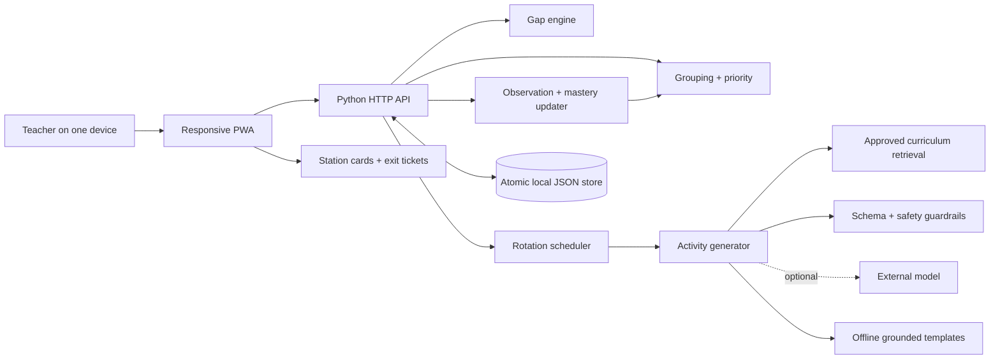

# Saarthi-MG architecture



## Closed-loop sequence

```text
attendance → gap detection → need-based groups → teacher priority
           → rotation + grounded activities → teacher approval
           → observation + exit check → mastery update → next groups
```

## Non-negotiable invariants

1. Each present learner appears in exactly one group, with no empty group and no more than the configured maximum.
2. Each rotation slot contains every group exactly once and exactly one teacher-involvement activity.
3. Every generated activity preserves its competency, level, duration, language, available materials, and approved source reference.
4. Absence is evidence of a possible missed opportunity, not proof of failure.
5. No automatic recommendation becomes an approved plan without teacher action.
6. Assessment changes only learners for whom evidence was submitted; every mastery delta remains explainable.

## Modules

| Module | Responsibility |
|---|---|
| `models.py` | Validated domain objects, competency graph, mastery rules |
| `gap_engine.py` | Recursive prerequisite, absence, and stale-evidence analysis |
| `engines.py` | Grouping, attention priority, and conflict-free rotations |
| `retrieval.py` | Deterministic search over the approved local corpus |
| `generator.py` | Structured activities, exit tickets, guardrails, optional model/fallback |
| `assessment.py` | Observation capture, mastery change, group movement explanation |
| `db.py` | Schema-versioned atomic persistence and demo reset |
| `api.py` | Application workflows and evaluation data |
| `server.py` | Static-file and JSON HTTP boundary with safe error handling |

## HTTP surface

- Read: `/api/health`, `/api/bootstrap`, `/api/students/{id}/mastery`, `/api/metrics`, `/api/analytics`
- Configure: `/api/classrooms`, `/api/students`, `/api/attendance`
- Plan: `/api/groups/generate`, `/api/groups/override`, `/api/schedule/generate`, `/api/activities/generate`
- Review: `/api/activities/{id}/update`, `/api/activities/{id}/regenerate`, `/api/plans/{id}/approval`
- Evidence: `/api/exit-ticket`, `/api/observations`, `/api/mastery/update`, `/api/next-plan`

